# Pet Project
A modern Spring Boot RESTful API project following MVC architecture, featuring Kafka integration, Docker support, automated testing, and CI/CD with GitHub Actions.

> 🇧🇷 Este projeto está disponível em português: [README.pt-BR.md](README.pt-BR.md)

<details>
<summary><b>Table of contents</b></summary>
  <ol>
    <li><a href="#-description">Description</a></li>
    <li><a href="#-features">Features</a></li>
    <li><a href="#-technologies">Technologies</a>
      <ul><li><a href="#maven">Maven</a></li></ul>
    </li>
    <li>
      <a href="#-getting-started">Getting Started</a>
      <ul>
        <li><a href="#prerequisites">Prerequisites</a></li>
        <li><a href="#usage">Usage</a></li>
      </ul>
    </li>
    <li><a href="#-demo">Demo</a></li>
    <li><a href="#-folder-structure">Folder Structure</a></li>
    <li><a href="#-useful-links">Useful Links</a></li>
    <li><a href="#-sequence-diagrams">Sequence Diagrams</a></li>
    <li><a href="#-testing">Testing</a></li>
    <li><a href="#-ci-and-cd">CI and CD</a></li>
    <li><a href="#-contributing">Contributing</a></li>
    <li><a href="#-author">Author</a></li>
    <li><a href="#-license">License</a></li>
  </ol>
</details>

### 📖 Description

This project is a comprehensive toolbox application featuring robust CRUD operations and seamless integration with modern technologies such as Spring Boot, Kafka, and Docker. Designed for scalability and maintainability, it leverages best practices in software engineering, including automated testing and CI/CD workflows via GitHub Actions. Ideal for learning, prototyping, or serving as a foundation for other services.

### ✨ Features

* **🔁 Full CRUD Operations** – Manage entities through RESTful APIs with clear separation of concerns.
* **📄 Pagination Support** – Efficiently handle large datasets with pageable endpoints.
* **⚙️ Asynchronous Endpoints** – Demonstrates how to run non-blocking operations using `CompletableFuture`.
* **📨 Kafka Integration** – Includes Kafka producers and consumers with example topics and message flow.
* **📤 Export Controller** – Provides endpoints to export data in various formats (e.g., CSV, PDF), enabling easy data extraction and integration with external systems.
* **📊 Sequence Diagrams** – Visual documentation of key controller interactions using PlantUML.
* **🧪 Test Coverage with JaCoCo** – Enforces 80% code coverage and generates readable HTML reports.
* **🧰 Swagger Integration** – Auto-generated API documentation using SpringDoc OpenAPI.
* **📋 H2 In-Memory Database** – Lightweight database for development and testing purposes.
* **📦 Docker-Ready** – Includes a `docker-compose` setup for Kafka and UI tools.
* **📈 Actuator Monitoring** – Spring Boot Actuator enabled for health checks and system monitoring.
* **♻️ DevTools Reloading** – Supports hot reloading via Spring DevTools for a smoother development experience.
* **🧹 Clean Architecture Principles** – Follows a layered structure with clear separation between controllers, services, models, and mappers, making the codebase easier to maintain, test, and extend.
* **🔐 Modular Dependency Setup** – Maven configuration using annotation processors and profile-based builds.
* **📁 Static Dashboard** – `index.html` provides shortcuts to useful development tools and visual aids.


### 📦 Technologies

[![Spring Boot][springboot-shield]][springboot-url] [![Spring Data JPA][jpa-shield]][jpa-url] [![Spring Web][web-shield]][web-url] [![Spring Boot Test][test-shield]][test-url] [![Springdoc OpenAPI][springdoc-shield]][springdoc-url] [![Spring Actuator][actuator-shield]][actuator-url] [![Spring Cache][cache-shield]][cache-url] [![DevTools][devtools-shield]][devtools-url]

[![Java][java-shield]][java-url] [![Maven][maven-shield]][maven-url] [![Kafka][kafka-shield]][kafka-url] [![Kafka UI][kafbat-shield]][kafbat-url] [![Docker][docker-shield]][docker-url] [![JUnit 5][junit5-shield]][junit5-url] [![Mockito][mockito-shield]][mockito-url] [![Swagger UI][swagger-shield]][swagger-url] [![H2 Database][h2-shield]][h2-url] [![Lombok][lombok-shield]][lombok-url] [![MapStruct][mapstruct-shield]][mapstruct-url] [![OpenCSV][opencsv-shield]][opencsv-url] [![OpenPDF][openpdf-shield]][openpdf-url] [](https://ambrosiaandrade.github.io/pets/jacoco/index.html)

### 💡 Getting Started

##### Prerequisites

You should have the following installed in your machine:

- Java 21+
- Maven
- Docker & Docker Compose

##### Usage

You can run the project in two ways depending on your development workflow:

---

#### ✅ Option 1: Run Everything with Docker (Spring Boot, Kafka, Kafka UI)

This approach builds and runs the entire stack — including the Spring Boot app, Kafka, and the Kafka UI dashboard — using Docker Compose.

```sh
docker-compose up --build
```

This command will:

* Build the Spring Boot application image (`app`)
* Spin up Kafka and Kafka UI
* Start everything connected in a shared Docker network

📸 Example:
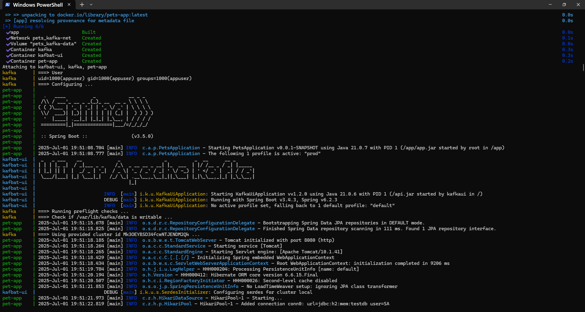

---

#### 🧪 Option 2: Run Spring Boot Separately (IDE + Docker for Kafka)

This is ideal for local development when you want to **debug or live-code the Spring Boot app in your IDE**, but still need Kafka running in containers.

1. **Comment out the Spring Boot app (`app`) section in `docker-compose.yml`:**

```yaml
#  app:
#    build: .
#    container_name: pet-app
#    ports:
#      - "8080:8080"
#    environment:
#      - SPRING_KAFKA_BOOTSTRAP_SERVERS=kafka:9092
#      - SPRING_PROFILES_ACTIVE=dev
#    depends_on:
#      - kafka
#    networks:
#      - kafka-net
```

2. **Set the active Spring profile to `dev`** in your `application.properties` (or use your IDE config):

```properties
spring.profiles.active=dev
```

3. **Start only Kafka-related services via Docker Compose:**

```sh
docker-compose up --build
```

4. **Run the Spring Boot application from your IDE.**

Make sure the profile is set to `dev` and Kafka is accessible via `localhost:9092` or the configured Docker network name (`kafka:9092`).


✅ **Result:** You now have a hybrid setup — Kafka running in Docker, Spring Boot running natively. This gives you faster iteration, hot reload support, and full IDE debugging capabilities.

### 🚀 Demo

You can check the [Pet Project here](https://pets-00xb.onrender.com/)

The `index.html` serves as a lightweight dashboard offering quick access to Swagger, H2 Console, Kafka UI, JaCoCo reports, and the GitHub repo.

_Note1: Kafka UI is available only when running locally (i.e., using the dev Spring profile with Docker Compose). In production, Kafka is disabled._

_Note2: JaCoCo is only available in production via GitHub Pages. Locally, it can be accessed at ``target/site/jacoco/index.html`` after running tests._

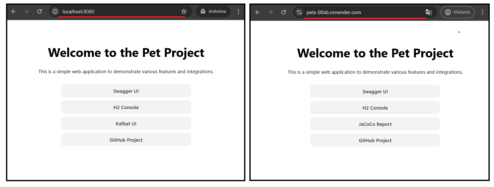

### 🗂️ Folder Structure

The project follows a clean, modular organization based on MVC principles:

```bash
src/
└── main/
    ├── java/com/ambrosiaandrade/pets/
    │   ├── config/         # Spring configuration classes
    │   ├── controller/     # REST controllers (web layer)
    │   ├── entities/       # JPA entities
    │   ├── enums/          # Domain enumerations
    │   ├── exceptions/     # Custom exception classes
    │   ├── interfaces/     # Mapper and service interfaces
    │   ├── listener/       # Event listeners
    │   ├── models/         # DTOs and domain models
    │   ├── repositories/   # Spring Data JPA interfaces
    │   ├── service/        # Business logic layer
    │   └── PetsApplication # Main Spring Boot application class
    └── resources/
        ├── static/         # Static assets (index.html, CSS, favicon)
        ├── application.properties
        ├── application-dev.properties
        ├── application-prod.properties
        └── data.sql        # Sample data initialization

```

### 🔗 Useful Links

- [Swagger UI](http://localhost:8080/swagger-ui/index.html)
    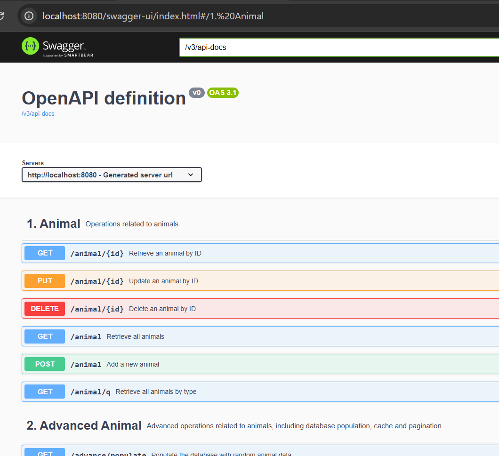 

    <details>

    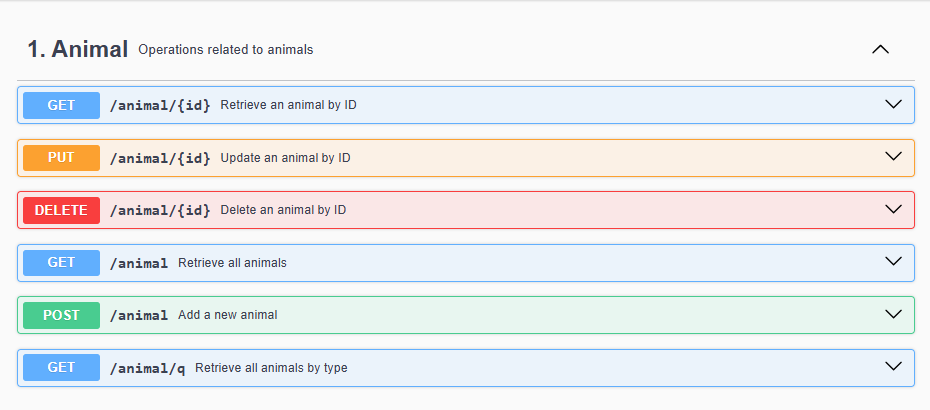
    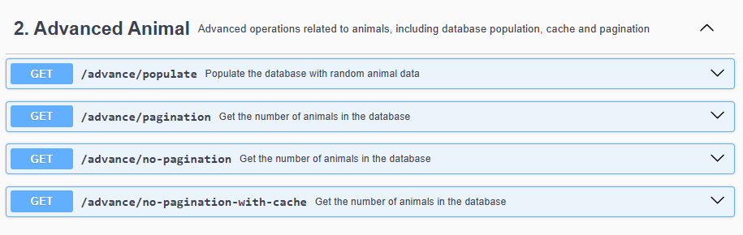
    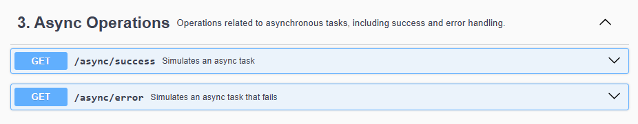
    
    

    </details>

- [H2 Console](http://localhost:8080/h2-console/)
  - URL: jdbc:h2:mem:testdb
  - User name: sa
  - Password: sa

  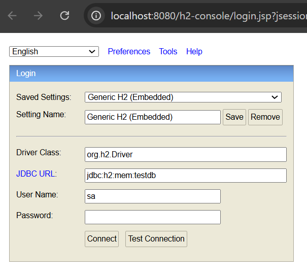 

- [Kafka UI](http://localhost:8081)
    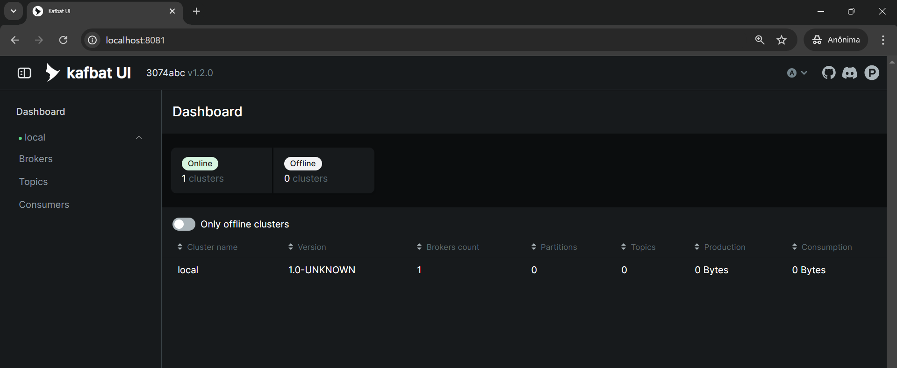  

### 🗂️ Sequences diagrams

Editable .puml files can be found at `./docs` folder.

<details>
<summary><b>Animal Controller</b></summary>

  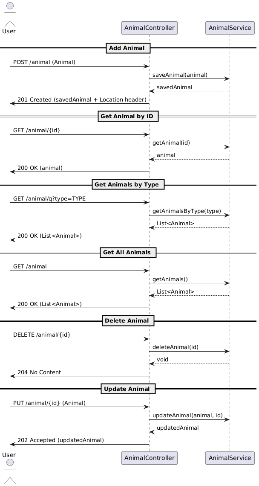
</details>

<details>
<summary><b>Pagination Controller</b></summary>

  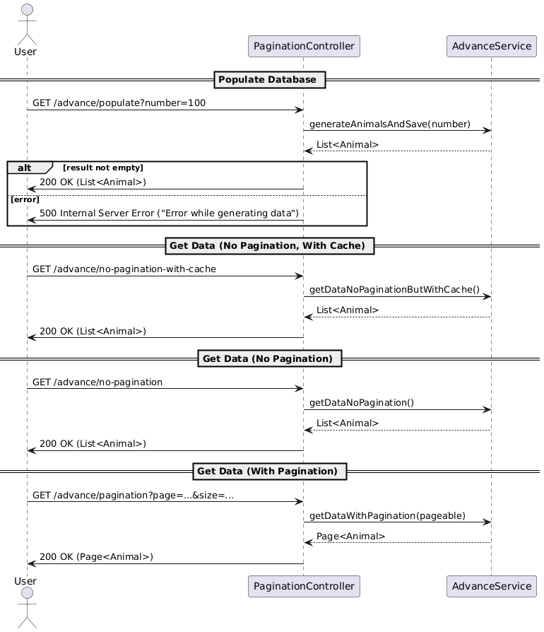

</details>

<details>
<summary><b>Async Controller</b></summary>

This controller serves as a demonstration of asynchronous processing in Java. It is intended for educational purposes and does not perform any real business logic.

  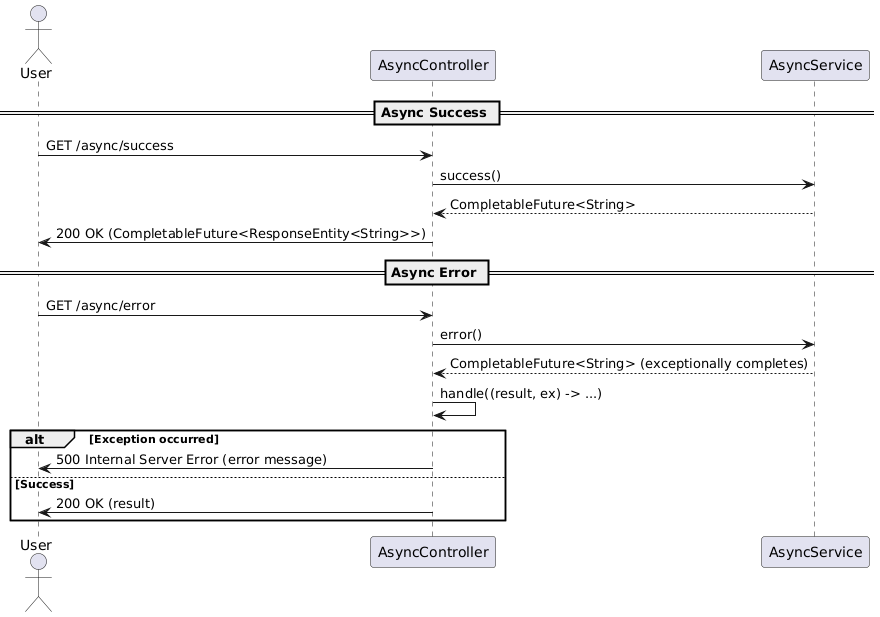

</details>

<details>
<summary><b>Export Controller</b></summary>

  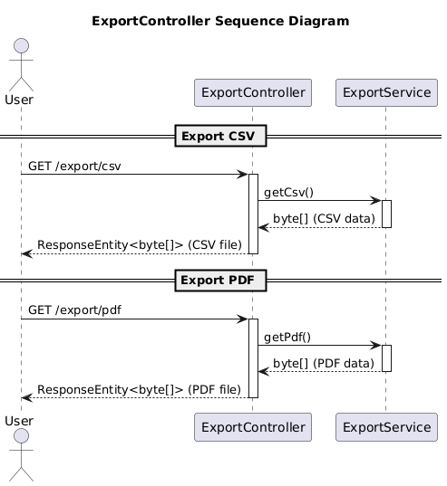

</details>

<details>
<summary><b>Kafka Controller</b></summary>

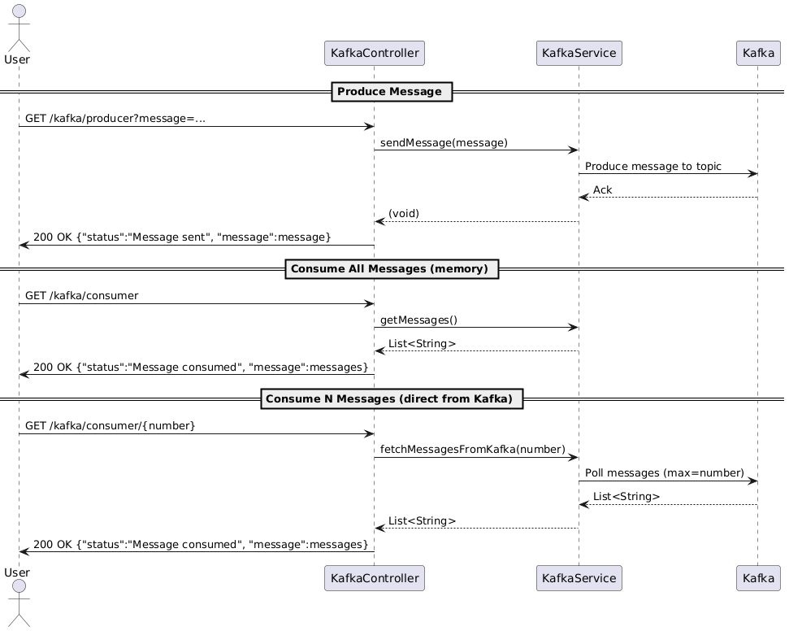

</details>

### 🧪 Testing

This project uses JUnit and Spring Boot Test for unit testing, along with Mockito for mocking dependencies.  
Code coverage is enforced with JaCoCo (80% minimum threshold), and the report is generated under `target/site/jacoco/index.html` locally or `https://ambrosiaandrade.github.io/pets/jacoco/index.html` in production.

To run tests:
```sh
mvn test
```

### ⚙️ CI and CD

This project uses **GitHub Actions** for Continuous Integration and Continuous Deployment.  
Every push and pull request triggers the workflow to:

- Build the project
- Run all tests and enforce code coverage

You can find the workflow definition in [`.github/workflows/`](.github/workflows/) in this repository.


### 🤝 Contributing

Contributions are welcome! If you'd like to help improve this project, feel free to fork it and submit a pull request.

### 🐱‍👤 Author

**Ambrósia Andrade** :brazil: <br/>
[![GitHub][github-shield]][github-url] [![LinkedIn][linkedin-shield]][linkedin-url] [![Gmail][gmail-shield]][gmail-url] [![Instagram][instagram-shield]][instagram-url]

### 📝 License

This project is licensed under the **[MIT License](LICENSE)** — see the file for details.

---
> Built with ❤️ using Spring Boot 3, MapStruct, Kafka, Docker, and CI/CD.  
> Ideal for learning, reference, or as a professional microservice template.

[](https://github.com/ambrosiaandrade/pets/stargazers)
[](https://github.com/ambrosiaandrade/pets)

<!-- MARKDOWN LINKS & IMAGES -->

[demo-url]: https://pets-00xb.onrender.com

[springboot-shield]: https://img.shields.io/badge/Spring_Boot-6DB33F?style=for-the-badge&logo=springboot&logoColor=white
[springboot-url]: https://spring.io/projects/spring-boot

[java-shield]: https://img.shields.io/badge/Java-21-007396?style=for-the-badge&logo=java&logoColor=white
[java-url]: https://www.oracle.com/java/

[maven-shield]: https://img.shields.io/badge/Maven-C71A36?style=for-the-badge&logo=apachemaven&logoColor=white
[maven-url]: https://maven.apache.org/

[kafka-shield]: https://img.shields.io/badge/Apache_Kafka-231F20?style=for-the-badge&logo=apachekafka&logoColor=white
[kafka-url]: https://kafka.apache.org/

[kafbat-shield]: https://img.shields.io/badge/Kafbat_UI-4B286D?style=for-the-badge&logo=apachekafka&logoColor=white
[kafbat-url]: https://github.com/kafbat/kafbat

[docker-shield]: https://img.shields.io/badge/Docker-2496ED?style=for-the-badge&logo=docker&logoColor=white
[docker-url]: https://www.docker.com/

[junit5-shield]: https://img.shields.io/badge/JUnit_5-25A162?style=for-the-badge&logo=junit5&logoColor=white
[junit5-url]: https://junit.org/junit5/

[mockito-shield]: https://img.shields.io/badge/Mockito-4EA94B?style=for-the-badge&logo=mockito&logoColor=white
[mockito-url]: https://site.mockito.org/

[swagger-shield]: https://img.shields.io/badge/Swagger_UI-85EA2D?style=for-the-badge&logo=swagger&logoColor=black
[swagger-url]: http://localhost:8080/swagger-ui/index.html

[h2-shield]: https://img.shields.io/badge/H2-4479A1?style=for-the-badge&logo=h2&logoColor=white
[h2-url]: https://www.h2database.com/

[jpa-shield]: https://img.shields.io/badge/Spring%20Data%20JPA-6DB33F?style=for-the-badge&logo=spring&logoColor=white
[jpa-url]: https://spring.io/projects/spring-data-jpa

[web-shield]: https://img.shields.io/badge/Spring%20Web-6DB33F?style=for-the-badge&logo=spring&logoColor=white
[web-url]: https://spring.io/projects/spring-boot

[lombok-shield]: https://img.shields.io/badge/Lombok-18A303?style=for-the-badge&logo=lombok&logoColor=white
[lombok-url]: https://projectlombok.org/

[test-shield]: https://img.shields.io/badge/Spring%20Boot%20Test-6DB33F?style=for-the-badge&logo=spring&logoColor=white
[test-url]: https://docs.spring.io/spring-boot/docs/current/reference/html/features.html#features.testing

[mapstruct-shield]: https://img.shields.io/badge/MapStruct-6C3483?style=for-the-badge&logo=mapbox&logoColor=white
[mapstruct-url]: https://mapstruct.org/

[springdoc-shield]: https://img.shields.io/badge/Springdoc%20OpenAPI-49A942?style=for-the-badge&logo=openapiinitiative&logoColor=white
[springdoc-url]: https://springdoc.org/

[actuator-shield]: https://img.shields.io/badge/Spring%20Actuator-6DB33F?style=for-the-badge&logo=spring&logoColor=white
[actuator-url]: https://docs.spring.io/spring-boot/docs/current/actuator-api/htmlsingle/

[cache-shield]: https://img.shields.io/badge/Spring%20Cache-6DB33F?style=for-the-badge&logo=spring&logoColor=white
[cache-url]: https://docs.spring.io/spring-boot/docs/current/reference/html/io.html#io.caching

[devtools-shield]: https://img.shields.io/badge/DevTools-6DB33F?style=for-the-badge&logo=spring&logoColor=white
[devtools-url]: https://docs.spring.io/spring-boot/docs/current/reference/html/using.html#using.devtools

[opencsv-shield]: https://img.shields.io/badge/OpenCSV-4E97A3?style=for-the-badge&logo=csv&logoColor=white
[opencsv-url]: http://opencsv.sourceforge.net/

[openpdf-shield]: https://img.shields.io/badge/OpenPDF-3776AB?style=for-the-badge&logo=adobeacrobatreader&logoColor=white
[openpdf-url]: https://github.com/LibrePDF/OpenPDF

<!-- Social media -->

[instagram-shield]: https://img.shields.io/badge/-Instagram-E4405F?style=for-the-badge&logo=instagram&logoColor=white
[instagram-url]:https://www.instagram.com/ambrosia_andrade_br/

[linkedin-shield]: https://img.shields.io/badge/-LinkedIn-black.svg?style=for-the-badge&logo=linkedin&colorB=blue
[linkedin-url]: https://linkedin.com/in/ambrosiaandrade

[gmail-shield]: https://img.shields.io/badge/-Gmail-EA4335?style=for-the-badge&logo=gmail&logoColor=white
[gmail-url]: mailto:ambrosiaandrade.pe@gmail.com

[github-shield]: https://img.shields.io/badge/-GitHub-181717?style=for-the-badge&logo=GitHub&logoColor=white
[github-url]: https://github.com/ambrosiaandrade
