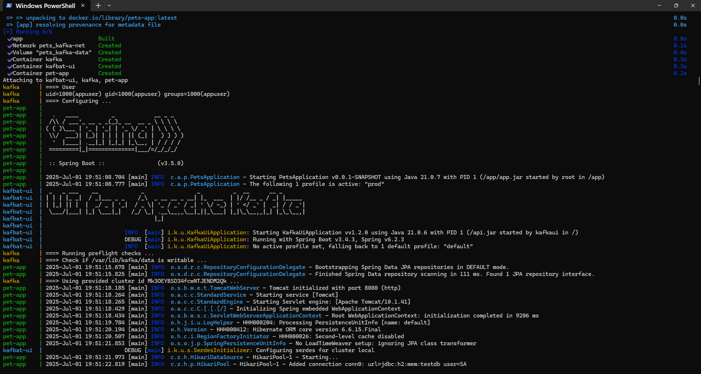
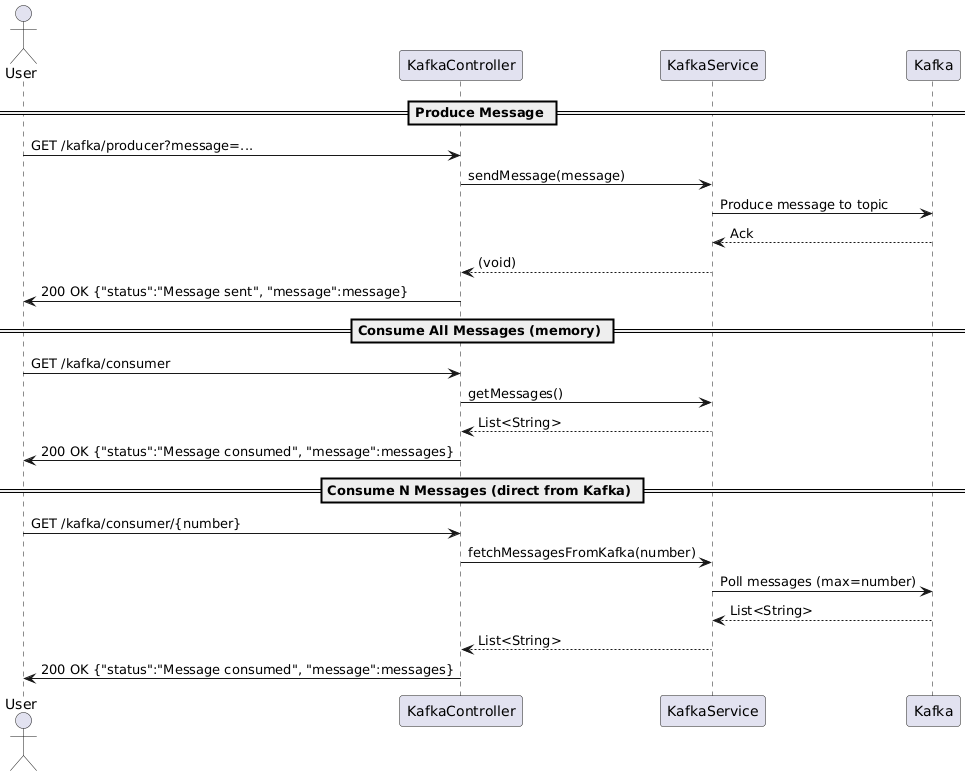

# Projeto Pet
Uma API RESTful moderna com Spring Boot seguindo a arquitetura MVC, com integração ao Kafka, suporte ao Docker, testes automatizados e CI/CD com GitHub Actions.

> 🇺🇸 This project is also available in English: [README.md](README.md)

<details>
<summary><b>📚 Índice</b></summary>
<ol>
  <li><a href="#-descrição">Descrição</a></li>
  <li><a href="#-funcionalidades">Funcionalidades</a></li>
  <li><a href="#-tecnologias">Tecnologias</a>
    <ul><li><a href="#maven">Maven</a></li></ul>
  </li>
  <li>
    <a href="#-primeiros-passos">Primeiros Passos</a>
    <ul>
      <li><a href="#pré-requisitos">Pré-requisitos</a></li>
      <li><a href="#uso">Uso</a></li>
    </ul>
  </li>
  <li><a href="#-demonstração">Demonstração</a></li>
  <li><a href="#-estrutura-de-pastas">Estrutura de Pastas</a></li>
  <li><a href="#-links-úteis">Links Úteis</a></li>
  <li><a href="#-diagramas-de-sequência">Diagramas de Sequência</a></li>
  <li><a href="#-testes">Testes</a></li>
  <li><a href="#-ci-e-cd">CI e CD</a></li>
  <li><a href="#-contribuindo">Contribuindo</a></li>
  <li><a href="#-autora">Autora</a></li>
  <li><a href="#-licença">Licença</a></li>
</ol>
</details>

### 📖 Descrição

Este projeto é uma aplicação toolbox completa, com operações robustas de CRUD e integração fluida com tecnologias modernas como Spring Boot, Kafka e Docker. Projetado para escalabilidade e manutenção, adota boas práticas de engenharia de software, incluindo testes automatizados e CI/CD com GitHub Actions. Ideal para aprendizado, prototipagem ou como base para outros serviços.

### ✨ Funcionalidades

* **🔁 Operações CRUD Completas** – Gerencie entidades via APIs REST com separação clara de responsabilidades.
* **📄 Suporte à Paginação** – Lide eficientemente com grandes conjuntos de dados por meio de endpoints pagináveis.
* **⚙️ Endpoints Assíncronos** – Demonstra como realizar operações não bloqueantes com `CompletableFuture`.
* **📨 Integração com Kafka** – Inclui produtores e consumidores com tópicos de exemplo e fluxo de mensagens.
* **📤 Controller de Exportação** – Endpoints para exportar dados em diversos formatos (CSV, PDF), facilitando integração com sistemas externos.
* **📊 Diagramas de Sequência** – Documentação visual das interações entre controllers usando PlantUML.
* **🧪 Cobertura de Testes com JaCoCo** – Exige 80% de cobertura mínima e gera relatórios HTML legíveis.
* **🧰 Integração com Swagger** – Documentação de API gerada automaticamente com SpringDoc OpenAPI.
* **📋 Banco de Dados H2 em Memória** – Banco leve para desenvolvimento e testes.
* **📦 Pronto para Docker** – Inclui `docker-compose` com Kafka e UI.
* **📈 Monitoramento com Actuator** – Health checks e métricas com Spring Boot Actuator.
* **♻️ Reload com DevTools** – Suporte a hot reload para melhorar a experiência de desenvolvimento.
* **🧹 Princípios de Arquitetura Limpa** – Estrutura em camadas com separação entre controllers, serviços, modelos e mappers.
* **🔐 Configuração Modular com Perfis** – Configuração com Maven e uso de perfis (`dev`, `prod`) com processadores de anotação.
* **📁 Dashboard Estático** – O `index.html` serve como atalho para ferramentas úteis de desenvolvimento e relatórios.


### 📦 Tecnologias

[![Spring Boot][springboot-shield]][springboot-url] [![Spring Data JPA][jpa-shield]][jpa-url] [![Spring Web][web-shield]][web-url] [![Spring Boot Test][test-shield]][test-url] [![Springdoc OpenAPI][springdoc-shield]][springdoc-url] [![Spring Actuator][actuator-shield]][actuator-url] [![Spring Cache][cache-shield]][cache-url] [![DevTools][devtools-shield]][devtools-url]

[![Java][java-shield]][java-url] [![Maven][maven-shield]][maven-url] [![Kafka][kafka-shield]][kafka-url] [![Kafka UI][kafbat-shield]][kafbat-url] [![Docker][docker-shield]][docker-url] [![JUnit 5][junit5-shield]][junit5-url] [![Mockito][mockito-shield]][mockito-url] [![Swagger UI][swagger-shield]][swagger-url] [![H2 Database][h2-shield]][h2-url] [![Lombok][lombok-shield]][lombok-url] [![MapStruct][mapstruct-shield]][mapstruct-url] [![OpenCSV][opencsv-shield]][opencsv-url] [![OpenPDF][openpdf-shield]][openpdf-url] [](https://ambrosiaandrade.github.io/pets/jacoco/index.html)

### 💡 Primeiros Passos

#### Pré-requisitos

Você deve ter os seguintes itens instalados na sua máquina:

* Java 21 ou superior
* Maven
* Docker & Docker Compose

---

#### 🧑‍💻 Uso

Você pode executar o projeto de duas formas, dependendo do seu fluxo de trabalho de desenvolvimento:

---

#### ✅ Opção 1: Rodar tudo com Docker (Spring Boot, Kafka e Kafka UI)

Este modo constrói e executa toda a stack — incluindo a aplicação Spring Boot, o Kafka e o painel Kafka UI — usando Docker Compose.

```sh
docker-compose up --build
```

Esse comando irá:

* Construir a imagem do Spring Boot (`app`)
* Subir os containers do Kafka e do Kafka UI
* Conectar tudo em uma rede Docker compartilhada

📸 Exemplo:


---

#### 🧪 Opção 2: Rodar Spring Boot separadamente (IDE + Kafka via Docker)

Ideal para desenvolvimento local quando você deseja **debugar ou programar diretamente no Spring Boot via IDE**, mas ainda precisa do Kafka em containers.

1. **Comente a seção da aplicação Spring (`app`) no `docker-compose.yml`:**

```yaml
#  app:
#    build: .
#    container_name: pet-app
#    ports:
#      - "8080:8080"
#    environment:
#      - SPRING_KAFKA_BOOTSTRAP_SERVERS=kafka:9092
#      - SPRING_PROFILES_ACTIVE=dev
#    depends_on:
#      - kafka
#    networks:
#      - kafka-net
```

2. **Defina o perfil `dev` no `application.properties`:**

```properties
spring.profiles.active=dev
```

3. **Inicie apenas os serviços do Kafka com Docker Compose:**

```sh
docker-compose up --build
```

4. **Execute a aplicação Spring Boot pela sua IDE.**

Garanta que o perfil ativo seja `dev` e que o Kafka esteja acessível via `localhost:9092` ou `kafka:9092` se estiver usando Docker.

✅ **Resultado:** Kafka roda em container, enquanto o Spring Boot roda nativamente — ideal para desenvolvimento com hot reload e debug.

### 🚀 Demonstração

Você pode acessar o [Pet Project aqui](https://pets-00xb.onrender.com/)

O arquivo `index.html` funciona como um painel leve com atalhos rápidos para Swagger, Console H2, Kafka UI, relatórios do JaCoCo e o repositório GitHub.

📌 **Nota 1:** Kafka UI está disponível **apenas localmente**, quando executado com o perfil `dev` via Docker Compose. Em produção, o Kafka é desabilitado.

📌 **Nota 2:** O relatório do **JaCoCo** está disponível **em produção** via GitHub Pages. Localmente, ele pode ser acessado em `target/site/jacoco/index.html` após rodar os testes.


---

### 🗂️ Estrutura de Pastas

O projeto segue uma organização modular e limpa, baseada em princípios do padrão MVC:

```bash
src/
└── main/
    ├── java/com/ambrosiaandrade/pets/
    │   ├── config/         # Classes de configuração do Spring
    │   ├── controller/     # Controladores REST (camada web)
    │   ├── entities/       # Entidades JPA
    │   ├── enums/          # Enumerações do domínio
    │   ├── exceptions/     # Classes de exceções personalizadas
    │   ├── interfaces/     # Interfaces de service e mapper
    │   ├── listener/       # Listeners de eventos
    │   ├── models/         # DTOs e modelos de domínio
    │   ├── repositories/   # Interfaces do Spring Data JPA
    │   ├── service/        # Camada de regras de negócio
    │   └── PetsApplication # Classe principal do Spring Boot
    └── resources/
        ├── static/                   # Recursos estáticos (index.html, CSS, favicon)
        ├── application.properties
        ├── application-dev.properties
        ├── application-prod.properties
        └── data.sql                  # Script de carga de dados
```

---

### 🔗 Links Úteis

* [Swagger UI](http://localhost:8080/swagger-ui/index.html)
  

<details>
<summary>Exemplos de chamadas</summary>


</details>

* [H2 Console](http://localhost:8080/h2-console/)

    * URL: `jdbc:h2:mem:testdb`
    * Usuário: `sa`
    * Senha: `sa`

  

* [Kafka UI](http://localhost:8081)
  

---

### 🧭 Diagramas de Sequência

Os arquivos `.puml` editáveis estão disponíveis na pasta `./docs`.

<details>
<summary><b>Animal Controller</b></summary>
  
</details>

<details>
<summary><b>Pagination Controller</b></summary>
  
</details>

<details>
<summary><b>Async Controller</b></summary>

Este controlador serve para demonstrar o uso de processamento assíncrono com Java. Ele é apenas educativo e não executa lógica de negócio real.


</details>

<details>
<summary><b>Export Controller</b></summary>
  
</details>

<details>
<summary><b>Kafka Controller</b></summary>
  
</details>

---

### 🧪 Testes

Este projeto utiliza **JUnit** e **Spring Boot Test** para testes unitários, juntamente com **Mockito** para simular dependências.

A cobertura de testes é **enforçada com JaCoCo**, exigindo no mínimo **80%**. O relatório gerado pode ser acessado em:

* **Localmente**: `target/site/jacoco/index.html` após executar os testes.
* **Produção**: via GitHub Pages em [`https://ambrosiaandrade.github.io/pets/jacoco/index.html`](https://ambrosiaandrade.github.io/pets/jacoco/index.html)

Para executar os testes, use o comando:

```sh
mvn test
```

---

### ⚙️ Integração e Entrega Contínuas (CI/CD)

Este projeto utiliza o **GitHub Actions** para pipelines de CI/CD.

A cada `push` ou `pull request` na branch `main`, o fluxo de trabalho é acionado para:

* Fazer o build do projeto
* Executar os testes automatizados
* Verificar a cobertura de código

Você encontra a definição do workflow em [`./github/workflows/`](.github/workflows/) neste repositório.


---

### 🤝 Contribuindo

Contribuições são bem-vindas!
Se quiser ajudar a melhorar este projeto, sinta-se à vontade para fazer um *fork*, criar sua branch e abrir um *pull request*.

---

### 🐱‍👤 Autora

**Ambrósia Andrade** 🇧🇷

[![GitHub][github-shield]][github-url] [![LinkedIn][linkedin-shield]][linkedin-url] [![Gmail][gmail-shield]][gmail-url] [![Instagram][instagram-shield]][instagram-url]

---

### 📝 Licença

Este projeto está licenciado sob a **[Licença MIT](LICENSE)** — veja o arquivo para mais detalhes.

---

> Feito com ❤️ usando Spring Boot 3, MapStruct, Kafka, Docker e CI/CD.
> Ideal para aprendizado, referência ou como template profissional para microsserviços.

[](https://github.com/ambrosiaandrade/pets/stargazers)
[](https://github.com/ambrosiaandrade/pets)


<!-- MARKDOWN LINKS & IMAGES -->

[demo-url]: https://pets-00xb.onrender.com

[springboot-shield]: https://img.shields.io/badge/Spring_Boot-6DB33F?style=for-the-badge&logo=springboot&logoColor=white
[springboot-url]: https://spring.io/projects/spring-boot

[java-shield]: https://img.shields.io/badge/Java-21-007396?style=for-the-badge&logo=java&logoColor=white
[java-url]: https://www.oracle.com/java/

[maven-shield]: https://img.shields.io/badge/Maven-C71A36?style=for-the-badge&logo=apachemaven&logoColor=white
[maven-url]: https://maven.apache.org/

[kafka-shield]: https://img.shields.io/badge/Apache_Kafka-231F20?style=for-the-badge&logo=apachekafka&logoColor=white
[kafka-url]: https://kafka.apache.org/

[kafbat-shield]: https://img.shields.io/badge/Kafbat_UI-4B286D?style=for-the-badge&logo=apachekafka&logoColor=white
[kafbat-url]: https://github.com/kafbat/kafbat

[docker-shield]: https://img.shields.io/badge/Docker-2496ED?style=for-the-badge&logo=docker&logoColor=white
[docker-url]: https://www.docker.com/

[junit5-shield]: https://img.shields.io/badge/JUnit_5-25A162?style=for-the-badge&logo=junit5&logoColor=white
[junit5-url]: https://junit.org/junit5/

[mockito-shield]: https://img.shields.io/badge/Mockito-4EA94B?style=for-the-badge&logo=mockito&logoColor=white
[mockito-url]: https://site.mockito.org/

[swagger-shield]: https://img.shields.io/badge/Swagger_UI-85EA2D?style=for-the-badge&logo=swagger&logoColor=black
[swagger-url]: http://localhost:8080/swagger-ui/index.html

[h2-shield]: https://img.shields.io/badge/H2-4479A1?style=for-the-badge&logo=h2&logoColor=white
[h2-url]: https://www.h2database.com/

[jpa-shield]: https://img.shields.io/badge/Spring%20Data%20JPA-6DB33F?style=for-the-badge&logo=spring&logoColor=white
[jpa-url]: https://spring.io/projects/spring-data-jpa

[web-shield]: https://img.shields.io/badge/Spring%20Web-6DB33F?style=for-the-badge&logo=spring&logoColor=white
[web-url]: https://spring.io/projects/spring-boot

[lombok-shield]: https://img.shields.io/badge/Lombok-18A303?style=for-the-badge&logo=lombok&logoColor=white
[lombok-url]: https://projectlombok.org/

[test-shield]: https://img.shields.io/badge/Spring%20Boot%20Test-6DB33F?style=for-the-badge&logo=spring&logoColor=white
[test-url]: https://docs.spring.io/spring-boot/docs/current/reference/html/features.html#features.testing

[mapstruct-shield]: https://img.shields.io/badge/MapStruct-6C3483?style=for-the-badge&logo=mapbox&logoColor=white
[mapstruct-url]: https://mapstruct.org/

[springdoc-shield]: https://img.shields.io/badge/Springdoc%20OpenAPI-49A942?style=for-the-badge&logo=openapiinitiative&logoColor=white
[springdoc-url]: https://springdoc.org/

[actuator-shield]: https://img.shields.io/badge/Spring%20Actuator-6DB33F?style=for-the-badge&logo=spring&logoColor=white
[actuator-url]: https://docs.spring.io/spring-boot/docs/current/actuator-api/htmlsingle/

[cache-shield]: https://img.shields.io/badge/Spring%20Cache-6DB33F?style=for-the-badge&logo=spring&logoColor=white
[cache-url]: https://docs.spring.io/spring-boot/docs/current/reference/html/io.html#io.caching

[devtools-shield]: https://img.shields.io/badge/DevTools-6DB33F?style=for-the-badge&logo=spring&logoColor=white
[devtools-url]: https://docs.spring.io/spring-boot/docs/current/reference/html/using.html#using.devtools

[opencsv-shield]: https://img.shields.io/badge/OpenCSV-4E97A3?style=for-the-badge&logo=csv&logoColor=white
[opencsv-url]: http://opencsv.sourceforge.net/

[openpdf-shield]: https://img.shields.io/badge/OpenPDF-3776AB?style=for-the-badge&logo=adobeacrobatreader&logoColor=white
[openpdf-url]: https://github.com/LibrePDF/OpenPDF

<!-- Social media -->

[instagram-shield]: https://img.shields.io/badge/-Instagram-E4405F?style=for-the-badge&logo=instagram&logoColor=white
[instagram-url]:https://www.instagram.com/ambrosia_andrade_br/

[linkedin-shield]: https://img.shields.io/badge/-LinkedIn-black.svg?style=for-the-badge&logo=linkedin&colorB=blue
[linkedin-url]: https://linkedin.com/in/ambrosiaandrade

[gmail-shield]: https://img.shields.io/badge/-Gmail-EA4335?style=for-the-badge&logo=gmail&logoColor=white
[gmail-url]: mailto:ambrosiaandrade.pe@gmail.com

[github-shield]: https://img.shields.io/badge/-GitHub-181717?style=for-the-badge&logo=GitHub&logoColor=white
[github-url]: https://github.com/ambrosiaandrade
